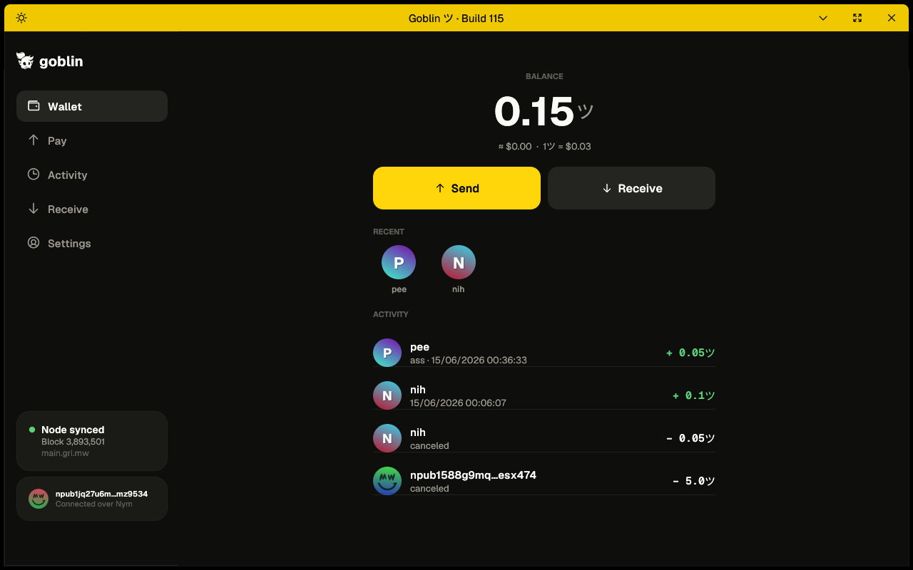

# Goblin

<a class="cta" href="quickstart.html"><strong>New here? Start with the Quick start →</strong>Set up your wallet, get paid, and pay someone in about two minutes.</a>

**Goblin is a private, mobile-first payments app for [Grin](https://grin.mw). Think Cash App, but the money is Grin, the addresses are usernames, and the whole conversation rides an anonymizing mixnet.**

You send to `alice`, not to a 90-character address. You tap *Pay/Request*, hold to confirm, and a Grin payment travels end-to-end encrypted over the [Nostr](https://github.com/nostr-protocol/nostr) network and the [Nym](https://nym.com) mixnet, so no relay, no network observer, and no chain analyst can tie the sender to the receiver.

Under the hood Goblin stands on three pillars:

| Pillar | What it gives Goblin |
| --- | --- |
| **[GRIM](pillars/grim-base.md)** | A complete, audited Grin wallet + node engine: seed, sync, and the Mimblewimble slatepack transaction machinery. Goblin forks it and keeps it. |
| **[Nostr](pillars/nostr.md)** | The messaging layer. Usernames, encrypted payment messages (gift-wrapped slatepacks), and offline delivery, all without running our own bespoke server. |
| **[Nym](pillars/nym.md)** | The transport. Every byte Goblin sends, relay traffic *and* every HTTP request, goes through a 5-hop mixnet. Nothing touches the clear net. |

## How to read these docs

The docs are organized from the outside in:

1. **[Overview](overview/what-is-goblin.md)**: what Goblin is and how the pieces fit.
2. **Pillars**: the three foundations ([GRIM](pillars/grim-base.md), [Nostr](pillars/nostr.md), [Nym](pillars/nym.md)), each broken into its component parts.
3. **[Features](features/payment-flow.md)**: the things you actually *do*: pay, request, claim a name, onboard.
4. **[Subsystems](subsystems/theme.md)**: the smaller machinery: themes, avatars, QR, localization, security.
5. **[Operating Goblin](self-hosting/index.html)**: run your own name authority, relay, and mixnet exit; build from source.

Every component page follows the same shape:

> **Summary**: one paragraph, what it is.
> **Motivation**: why it exists, the problem it solves.
> **How it works**: a plain-language walkthrough, with screenshots.
> **Reference**: the technical detail: types, functions, wire formats.
> **References**: links into the source (`file:line`) and the external standards.

> Goblin is open source. Where these docs cite code, they point at the public source tree so you can read along.
